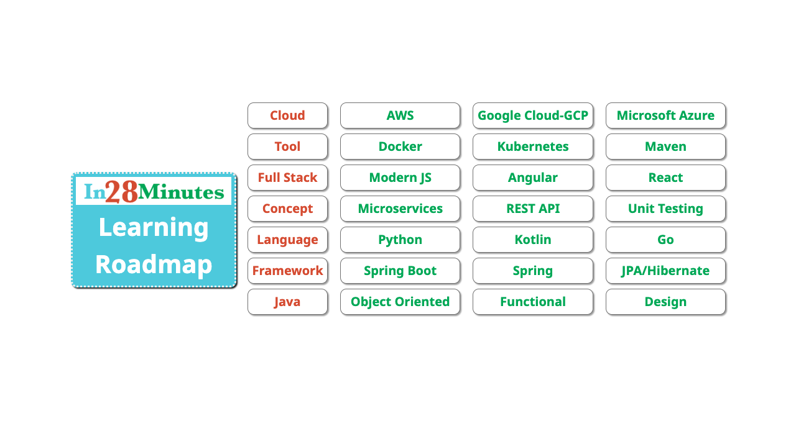
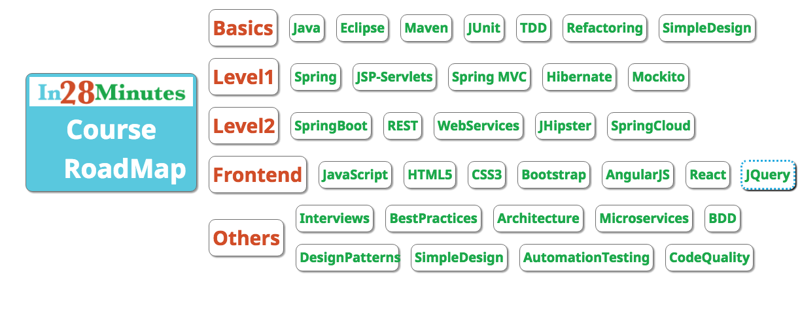

# in28Minutes Learning Roadmap

Learn Page - https://github.com/in28minutes/learn#best-selling-courses

## My Views - Updated July 2019
- Architectures are heading towards Microservices and Cloud!
- Spring Boot is the most popular framework for developing Microservices
- Spring Cloud provides great options to developing Cloud Native Applications. How well it does is yet to be seen!
- Staying Cloud Neutral is becoming out of fashion
- As a aspiration web programmer, I recommend to learn
	- Java/Python - Be an expert at your language. 
	- Basics of Design - 4 Principles of Simple Design
	- Be good at your IDE - Eclipse.
	- Understand the build tool - Maven.
	- Build one web application with JSP Servlets - Its great to know the basics. 
	- Build one web application with Spring MVC.
	- Understand Spring and Spring Boot in depth. The more you understand them the more you would love them.
	- Build REST Services with Spring MVC.
	- Get comfortable with Frontend Frameworks.
- If you want to move further ahead
	- Understand Microservices architectures! Start with Spring Cloud and AWS.
	- Understand Cloud! Start with AWS or Azure.
	- Understand Containerization - Start with Docker.
	- Understand Functional and Reactive Programming.
	- Understand Kubernetes
	- Understand BigData and Analytics - Start with Hadoop.
	- Understand Messaging - Kafka, AMQP and JMS. 
	- Understand Continuous Integration, Delivery and DevOps.
- Look at the Roadmap Image
## Basics
 - Java
 - Eclipse - You should be good at your IDE. You spend more than 50% of your working time on the IDE.
 - Maven - You should understand the build tool Maven. Makes you very productive at setting up new projects.
 - JUnit - You are expected to be awesome at writing Unit Tests.
 - TDD
 	- https://www.youtube.com/watch?v=xubiP8WoT4E&list=PLBD6D61C0A9F671F6
 - Refactoring
 - SimpleDesign
 	- https://www.youtube.com/watch?v=OwS8ydVTx1c&list=PL066F8F24976D837C

## Level1
 - Spring
 - Spring MVC
 - JPA/Hibernate
 - Mockito

## Level2
 - SpringBoot
 - REST WebServices
 - SOAP WebServices
 - JHipster
 - SpringCloud

## Frontend
 - JavaScript
 - HTML5
 - CSS3
 - Bootstrap
 - AngularJS
 - React
 - JQuery

## Others
 - Interviews
 	- Java - https://www.udemy.com/java-interview-questions-and-answers/?couponCode=JAVA_INTER_GIT
 - BestPractices
 - Architecture
 	- Java EE Architecture, Frameworks and Patterns - https://www.udemy.com/java-ee-design-patterns-architecture-and-frameworks/?couponCode=EEPATTERNS-GIT
 - Microservices
 - BDD
 - DesignPatterns
 	- http://in28minutes.teachable.com/p/a-beginner-s-guide-to-design-patterns
 - AutomationTesting
 - CodeQuality

## My Views - Updated May 2017

- Architectures are heading towards Microservices!
- Anybody who wants to develop web applications with Java must learn Spring & Spring MVC. They are most used frameworks in the Java world today.
- Spring Boot is the most popular framework for developing Microservices
- Spring Cloud provides great options to developing Cloud Native Applications. How well it does is yet to be seen!
- As a aspiration web programmer, I recommend to learn
	- Java - Be an expert at your language. 
	- Basics of Design - 4 Principles of Simple Design
	- Be good at your IDE - Eclipse.
	- Understand the build tool - Maven.
	- Build one web application with JSP Servlets - Its great to know the basics. 
	- Build one web application with Spring MVC.
	- Understand Spring and Spring Boot in depth. The more you understand them the more you would love them.
	- Build REST Services with Spring MVC.
	- Get comfortable with Frontend Frameworks.
- If you want to move further ahead
	- Understand Microservices architectures! Start with Spring Cloud and AWS.
	- Understand BigData and Analytics - Start with Hadoop.
	- Understand Messaging - Kafka, AMQP and JMS. 
	- Understand Functional and Reactive Programming.
	- Understand Continuous Integration, Delivery and DevOps.
	- Understand Containerization - Start with Docker.

## Basics
 - C - You should be an expert the language you are using
 	- Beginner - http://in28minutes.teachable.com/p/c-tutorial-for-beginners
 	- Puzzles - https://www.udemy.com/c-puzzles-for-beginners/?couponCode=CPUZZLES-GIT
 - Java
 	- OOPS Advanced - https://www.udemy.com/learn-object-oriented-programming-in-java/?couponCode=OOPS-GIT
 - Eclipse - You should be good at your IDE. You spend more than 50% of your working time on the IDE.
 	- http://in28minutes.teachable.com/p/eclipse-tutorial-for-beginners-learn-java-ide-in-10-steps
 - Maven - You should understand the build tool Maven. Makes you very productive at setting up new projects.
 	- https://www.udemy.com/learn-maven-java-dependency-management-in-20-steps/?couponCode=MAVEN_GIT
 - JUnit - You are expected to be awesome at writing Unit Tests.
 	- https://www.udemy.com/junit-tutorial-for-beginners-with-java-examples/
 - TDD
 	- https://www.youtube.com/watch?v=xubiP8WoT4E&list=PLBD6D61C0A9F671F6
 - Refactoring
 - SimpleDesign
 	- https://www.youtube.com/watch?v=OwS8ydVTx1c&list=PL066F8F24976D837C

## Level1
 - Spring
 	- http://in28minutes.teachable.com/p/spring-framework-tutorial-for-beginners
 - JSP-Servlets
 	- https://www.udemy.com/learn-java-servlets-and-jsp-web-application-in-25-steps/?couponCode=JSPSRVLT-GIT
 - Spring MVC
 	- https://www.udemy.com/spring-mvc-tutorial-for-beginners-step-by-step/?couponCode=SPRINGMVC-GIT
 - JPA/Hibernate
 - Mockito
 	- https://www.udemy.com/mockito-tutorial-with-junit-examples/?couponCode=MOCKITO_GIT

## Level2
 - SpringBoot
 	- https://www.udemy.com/spring-boot-tutorial-for-beginners/?couponCode=SPRING-BOOT-GIT
 - REST WebServices
 - SOAP WebServices
 - JHipster
 - SpringCloud

## Frontend
 - JavaScript
 - HTML5
 - CSS3
 - Bootstrap
 - AngularJS
 - React
 - JQuery

## Others
 - Interviews
 	- Java - https://www.udemy.com/java-interview-questions-and-answers/?couponCode=JAVA_INTER_GIT
 - BestPractices
 - Architecture
 	- Java EE Architecture, Frameworks and Patterns - https://www.udemy.com/java-ee-design-patterns-architecture-and-frameworks/?couponCode=EEPATTERNS-GIT
 - Microservices
 - BDD
 - DesignPatterns
 	- http://in28minutes.teachable.com/p/a-beginner-s-guide-to-design-patterns
 - AutomationTesting
 - CodeQuality
